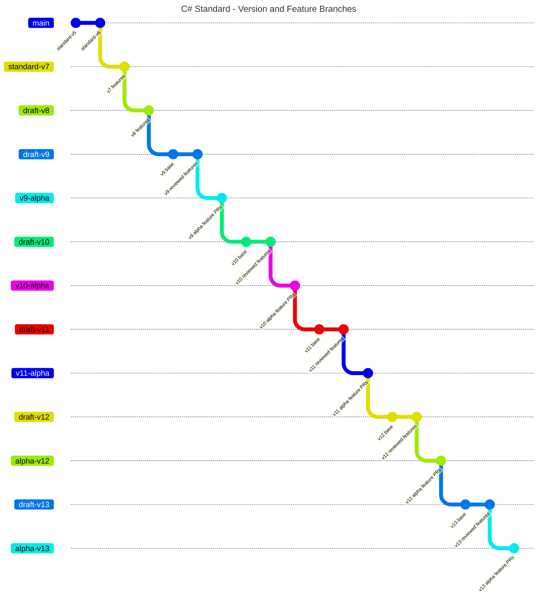

# Version and Feature branch diagram

We've started building branches that have preliminary text for the C# language features in versions greater than the current standard. This gives the committee a look forward to how other features could be integrated into the standard. We also hope it enables us to move more quickly by having drafts ready for all future versions.

A downside is that we have more complicated branch management to ensure changes we make in the standard at version 8 are propagated forward through all the branches for each upcoming version.

The following diagram shows the primary branches we're using in this process.  Our naming conventions are as follows:

- Branches that have the prefix *standard* represent the approved ECMA standard for the stated version.
- Branches that have the *draft* represent the current working draft for the stated version. Updates in the *draft* branches have been approved by the committee. However, feature language may be incomplete. Issues for the draft are generally tracked with issues.
- Branches that have the *alpha* suffix represent a "feature complete" version of the standard. However, the language for any features not incorporated in the standard hasn't been discussed by the committee.

Note that all alpha versions beyond the next version (version 9) are built on the previous version's alpha branch. Therefore the unreviewed language in the *alpha* branches accumulates with each version ahead of the committee.



After each meeting, all changes merged since the previous meeting are propagated through each of the version specific branches. The following diagram shows the workflow:

```mermaid
---
title: C# Standard - Version and Feature Branches
---
gitGraph
   commit id: "standard-v5"
   commit id: "standard-v6"
   branch standard-v7
   checkout standard-v7
   commit id: "v7 features"
   branch draft-v8
   checkout draft-v8
   commit id: "v8 features"
   branch draft-v9
   checkout draft-v9
   commit id: "v9 base"
   commit id: "v9 reviewed features"
   branch v9-alpha
   commit id: "v9 alpha feature PRs"
   branch draft-v10
   checkout draft-v10
   commit id: "v10 base"
   commit id: "v10 reviewed features"
   branch v10-alpha
   commit id: "v10 alpha feature PRs"
   branch draft-v11
   checkout draft-v11
   commit id: "v11 base"
   commit id: "v11 reviewed features"
   branch v11-alpha
   commit id: "v11 alpha feature PRs"
   branch draft-v12
   checkout draft-v12
   commit id: "v12 base"
   commit id: "v12 reviewed features"
   branch alpha-v12
   commit id: "v12 alpha feature PRs"
   checkout draft-v8
   commit id: "PRs merged at meeting"
   checkout draft-v9
   merge draft-v8
   checkout v9-alpha
   merge draft-v9
   checkout draft-v10
   merge v9-alpha
   checkout v10-alpha
   merge draft-v10
   checkout draft-v11
   merge v10-alpha
   checkout v11-alpha
   merge draft-v11
   checkout draft-v12
   merge v11-alpha
   checkout alpha-v12
   merge draft-v12
   checkout draft-v13
   merge alpha-v12
   checkout alpha-v13
   merge draft-v13
```

The changes approved by the committee are propagated in turn through all *draft* and *alpha* branches for upcoming versions. This process will introduce conflicts in feature specific PRs that will be resolved after the above workflow is completed.
